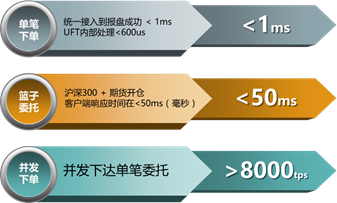

# 系统简介

恒投交易客户端是一款定位于轻量级、专业化的投资交易管理平台，其基于恒生成熟的O32系统，同时针对机构灵活的投资交易模式、简洁高效的运维管理等方面进行了针对性的优化。恒投交易客户端支持多市场、多业务品种，以满足不同类型产品的投资需要；支持包含自动交易、算法交易、期现套利、篮子交易在内的多种交易方式；支持现货、期货多账户交易等；支持外部交易策略通过恒生统一接入接口（UFX）接入系统，以满足风险监控等资产管理的需要。

恒投交易客户端主要特点如下：

（1）更极速的交易体验

1. 恒投交易客户端提供内存化交易方案，专注于交易业务快速处理，采用全内存数据库技术与并行流水线技术实现毫秒级委托订单业务处理。高并发处理能力、高可用/高可靠性，完全能够满足机构量化策略、程序化交易需求。
2. 极速下单性能：并发处理能力大于8000笔/s
3. 超大委托容量：支持每日300万以上交易量
4. 极低单笔延时：单笔交易延时 < 3ms
5. 多活灾备支持：采用多活架构，真正做到硬件故障切换零耗时
6. 容量平行扩展：通过添加硬件的方式，实现真正的交易容量和交易性能的平行扩展
7. 全面业务覆盖：市场上唯一支持股票、基金、个股期权、期货等全业务的内存交易系统，支持跨市场交易、混合下单。

  
_Figure 1: The Markdown Mark_
